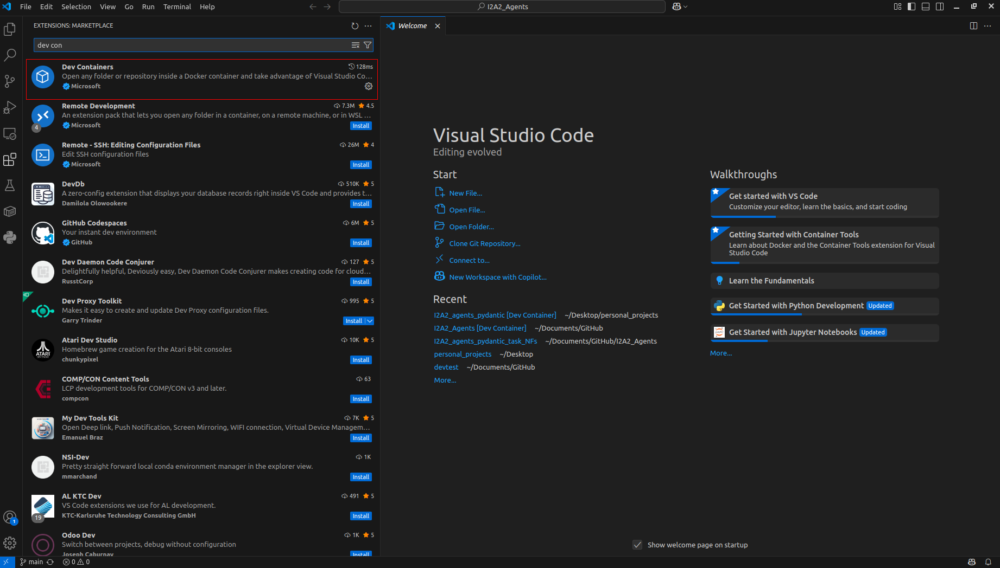
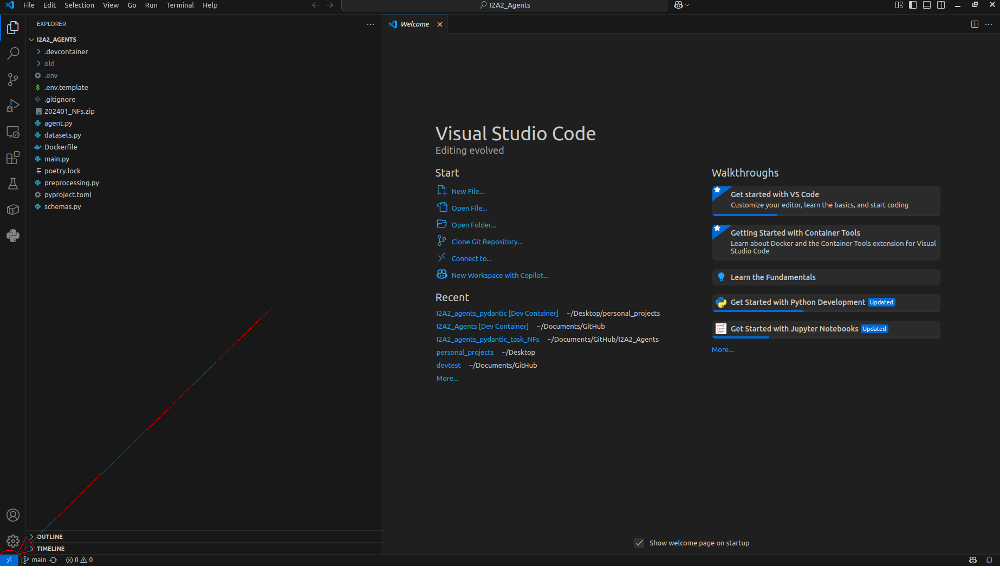
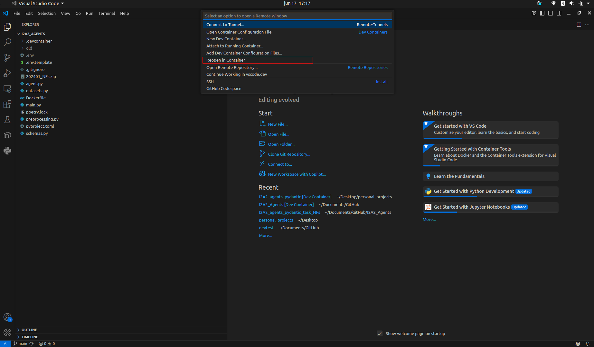
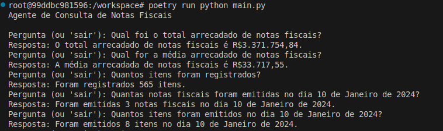

# Introduction: Dev Containers

First, make sure you have [Visual Studio Code](https://code.visualstudio.com/) installed. Then, install the **Dev Containers** extension by searching for it in the Extensions view.



After installing the extension, open the repository in VS Code and click the blue button at the bottom-left corner.



Finally, search for **“Reopen in Container”** or **“Rebuild Container”**.



---

# Configure your `.env` file

Use the `.env.template` file to create your own `.env` file. Then, add your LLM API key to the `API_KEY` variable.

> ⚠️ This solution was built using **Groq**, so we recommend using the same `API_BASE` and `MODEL` values suggested in the comments within the `.env.template`.

---

# Use the Agent!

Once you're inside the I2a2 Agents container and your `.env` file is properly configured, open the terminal and run:

```
poetry run python main.py
```

---

# Example

You should see answers like the one below:


